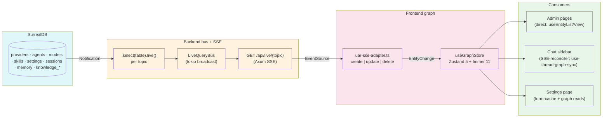

# Plan — `readme-architecture-diagram`

**Date:** 2026-05-27
**Tool:** claude-code (`/kbd-plan`)
**Backend:** OpenSpec
**Decisions:** defaults from assessment §6 — Mermaid, ≤250 lines, entity table authored in README, footnote-style bridge retirement

---

## Ordered change list (3)

| # | Change ID | Title | Effort | Insertion |
|---|---|---|---|---|
| 1 | `author-readme-entity-architecture-section` | New "Frontend Architecture — Realtime Entity Graph" section with Mermaid diagram, 12-entity table, 3 pattern descriptions, CI gates callout, terminal aesthetic callout | S | Between "UI Stack" (line 388) and "Memory System" (line 390) |
| 2 | `add-bridge-retirement-footnote` | One-line acknowledgment of the retired bridge pattern within the new section | XS | Same section, near the end |
| 3 | `link-from-audit-back-to-readme` | Symmetric back-link in `docs/migration-stale-data-audit.md` intro | XS | Audit doc head |

Note: Change 2 is small enough that we'll inline it into change 1's PR (single commit) but track it as its own change for OpenSpec traceability.

---

## Per-change synopsis

### 1. `author-readme-entity-architecture-section`

Insert between `## UI Stack` block and `## Memory System` block. Structure:

```md
---

## Frontend Architecture — Realtime Entity Graph

UAR's admin surface and chat sidebar share a single realtime spine: every
mutation in SurrealDB fans out through a tokio broadcast bus, an SSE
endpoint, and the `useGraphStore` graph in the SPA. Admin pages and chat
state read from the graph; SSE keeps it fresh. **No admin page polls.**
**No page goes stale.**

### Data flow



### Entity inventory

| Entity | Topic | Pattern | Notes |
|---|---|---|---|
| Provider | `providers` | direct | catalog + configured rows + `ProviderMeta` singleton for default |
| Agent | `agents` | direct | nested `metadata`/`policy`/`memory` shape preserved |
| Model | `models` | direct | flattened from `CatalogModelsResponse` on hydration |
| Skill | `skills` | direct | optimistic toggle / edit / delete |
| Memory | `memory` | direct | per-query view; `MemoryMeta` singleton holds stats |
| CompilerSession | `compiler_sessions` | direct | tiny page; established shared admin components |
| KnowledgeBase | `knowledge_bases` | direct | via `useKnowledgePage` compat hook |
| Document | `knowledge_documents` | direct | optimistic upload status progression |
| Setting | `settings` | direct (form-cache) | dirty/conflicts/saving via `settings-form-cache.ts` |
| Tool | (no SSE) | direct (fetch-on-mount) | registry is static after server startup |
| McpStatus | (no SSE) | direct (poll-fed graph) | 30 s poll hydrates graph rows |
| Thread | `threads` (alias `sessions`) | SSE-reconciler | client-first creation; graph events reconcile into PGlite registry |
| ApiKey | (none) | non-realtime | secrets never broadcast |

### Patterns

1. **Direct migration playbook** — graph is the source of truth. Pages read
   via `useEntityList` / `useEntityView` / `useEntity` hooks; mutations
   call services directly, wrapped in
   [`optimisticUpsert` / `optimisticRemove`](./frontend/src/lib/realtime/optimistic.ts).
   SSE keeps the graph fresh.

2. **SSE-reconciler pattern** — for client-first entities (Threads). The
   local store is authoritative; a small hook
   ([`use-thread-graph-sync.ts`](./frontend/src/stores/use-thread-graph-sync.ts))
   subscribes to the graph and reconciles server events into the local
   store. No REST refetch needed — live-only sync is acceptable.

3. **Form-cache pattern** — for pages with dirty/save semantics (Settings).
   A module-level `Map<namespace, DirtyState>` consumed via
   `useSyncExternalStore` holds transient form state; commits POST in bulk
   with optimistic graph upsert + rollback.

Full migration history, playbooks, and contract tests:
[`docs/migration-stale-data-audit.md`](./docs/migration-stale-data-audit.md).

### CI architectural gates

Every PR runs [`scripts/ci-grep-gates.sh`](./scripts/ci-grep-gates.sh) plus
the standard frontend pipeline. The gates block regressions on the
architectural invariants this spine depends on:

- `useGraphBridge` retired (interim pattern, permanently retired 2026-05-27)
- `useSettingsStore` retired
- No banned fonts in admin CSS (per [`docs/admin-aesthetic-spec.md`](./docs/admin-aesthetic-spec.md))
- No `outline: none` on admin interactive elements

Local equivalent: `pnpm run ci-gates`.

### Terminal admin aesthetic

Admin pages render under a scoped `data-admin-theme="terminal"` attribute
on `<html>` (set by `pages/admin-page.tsx` on mount). CSS tokens
(`--terminal-bg`, `--phosphor`, `--amber`, `--signal-red`) live under
that selector in `frontend/src/index.css`; the chat surface retains its
existing Ember/UAR Dark theme.

Shared components — `<LoadingCursor>`, `<EmptyFrame>`, `<ErrorBar>` —
live in `frontend/src/components/admin/`.

### Historical: bridge pattern

An interim `useGraphBridge` hook briefly carried per-entity bridges
during the migration arc. Permanently retired 2026-05-27 once every
consumer adopted the Direct migration or SSE-reconciler pattern. See
[the audit's Historical appendix](./docs/migration-stale-data-audit.md#historical-bridge-pattern-permanently-retired-2026-05-27)
for the full retirement story.

---
```

**Verification:** `pnpm run ci-gates` exits 0; the section reads cleanly; Mermaid renders.

### 2. `add-bridge-retirement-footnote`

The "Historical: bridge pattern" block above already includes this; tracked separately for OpenSpec traceability but folded into change 1's commit.

### 3. `link-from-audit-back-to-readme`

Add a one-line note at the top of `docs/migration-stale-data-audit.md` (just under the title) pointing readers to the README's frontend architecture section for the high-level summary:

```md
**See also:** [README → Frontend Architecture — Realtime Entity Graph](../README.md#frontend-architecture--realtime-entity-graph) for the executive summary diagram.
```

**Verification:** link resolves; no other diffs needed.

---

## Verification matrix

| Gate | When |
|---|---|
| `pnpm run ci-gates` exits 0 | every change |
| `pnpm --filter ./frontend test` ≥ 40/40 | every change (sanity — no test changes expected) |
| `pnpm --filter ./frontend build` clean | every change |
| Mermaid block parses (visual review or `mmdc --validate`) | change 1 |
| New section ≤ 250 lines | change 1 |
| Link from README → audit doc resolves | change 1 |
| Link from audit doc → README resolves | change 3 |

---

## Risk register

| Risk | Mitigation |
|---|---|
| Mermaid syntax errors break GitHub render | Preview locally before commit; keep diagram simple |
| Section bloat exceeds 250-line budget | Each pattern ≤ 3 sentences; full details stay in audit doc |
| Audit-doc front-matter conflict with the new link | Insert as standalone paragraph after the title, before TOC |

---

## Next step

`/kbd-execute readme-architecture-diagram` — tiny phase, proceed straight through.
