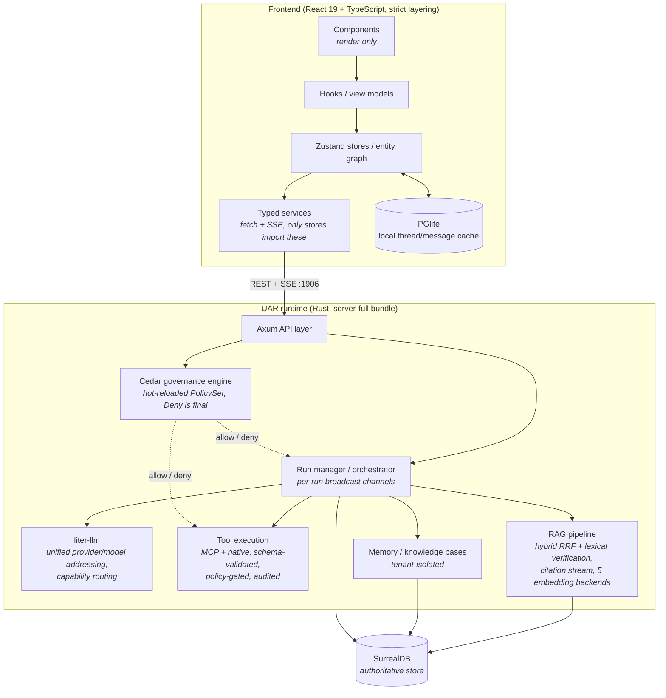
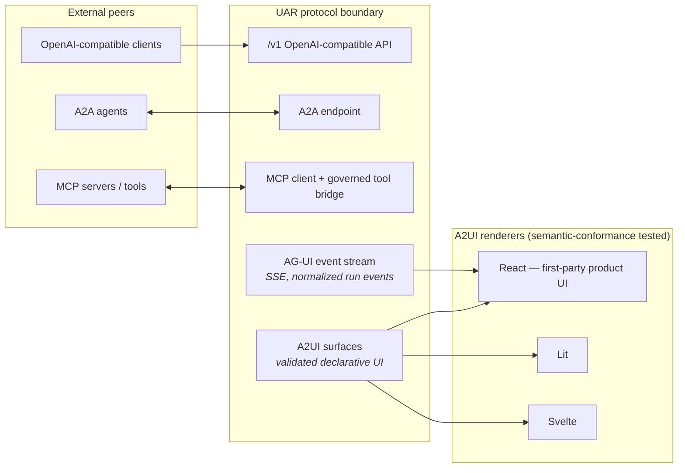
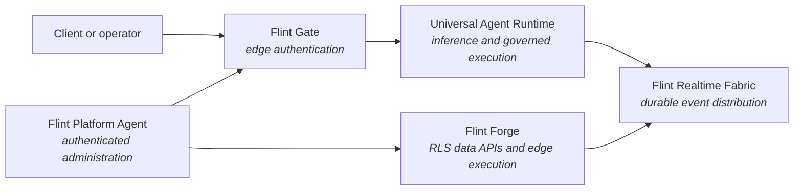
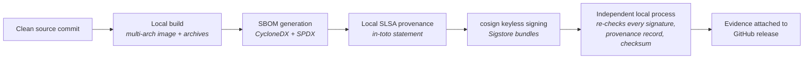

<p align="center">
  
</p>

<p align="center"><strong>Governed execution. Typed protocols. One runtime boundary.</strong></p>

<p align="center">
  <a href="LICENSE"></a>
  
  <a href="https://prometheus-ags.github.io/universal-agent-runtime/"></a>
</p>

# Universal Agent Runtime

Universal Agent Runtime (UAR) is a Rust/Axum runtime for governed agent execution, model routing, typed streaming, tools, retrieval, and declarative agent UI. Its first-party operator interface is React 19 + TypeScript.

UAR is at version **1.0.0**. The distributed server/sidecar product is the `server-full` bundle; it includes the React application, document intelligence, governance, telemetry, and supported protocol surfaces. The dependency-light `minimal` bundle remains a Stable headless profile, not the packaged customer distribution. See the [product support matrix](docs/product-support-matrix.md) before making deployment commitments.

The [GitHub Pages documentation portal](https://prometheus-ags.github.io/universal-agent-runtime/) covers installation, architecture, SDKs, skills, deployment, and security; begin with the [introduction](https://prometheus-ags.github.io/universal-agent-runtime/docs/intro). Its live routes are verified by the final documentation publication change.

## What is supported

- OpenAI-compatible and Anthropic execution paths have named Tier 1 capability evidence. Local FastEmbed embeddings are also Tier 1.
- The committed catalog contains metadata for 269 providers. A catalog entry is discovery data, not proof that execution is certified.
- Catalog, availability, and policy routing are Stable. Adaptive learned routing is Experimental.
- MCP-discovered and native tools share schema validation, Cedar policy, approval, hard-deny, and audit controls. Native WASM tools are Preview and opt-in.
- Web is Stable. Desktop/Tauri and native WASM are Preview. Mobile is Experimental. Browser-side arbitrary WASM execution is unsupported.

The machine-readable source of truth is [docs/product-support-matrix.json](docs/product-support-matrix.json).

## Architecture

UAR is a single Rust/Axum process that owns inference routing, agent
execution, governance, retrieval, and event distribution, with a strictly
layered React 19 frontend. The frontend never talks to providers, tools,
or storage directly — everything crosses one governed REST/SSE boundary
on port 1906.



The browser consumes normalized runtime events. **AG-UI is the event
transport vocabulary**; **A2UI is the validated declarative rendering
contract**. A2UI artifacts map to an approved component catalog and never
execute model-provided HTML or JavaScript.

### Protocol surfaces



The A2UI catalog is certified per profile: 9 protocol components
(`Text`, `Button`, `TextField`, `CheckBox`, `ChoicePicker`, `Row`,
`Column`, `Card`, `Divider`) under `urn:uar:a2ui:catalog:1`, plus 7 UAR
entity extension components under `urn:uar:a2ui:catalog:1+entities`.
Unknown component types fail closed. All three renderers are built on the
same vendored `@a2ui/web_core` state model and share a semantic
conformance fixture asserting equivalent roles, accessible names, states,
and text across frameworks.

### Run lifecycle and live UI updates

```mermaid
sequenceDiagram
    participant Client as Client (any A2UI renderer)
    participant API as Axum API
    participant RM as Run manager
    participant Cedar as Cedar governance
    participant LLM as liter-llm provider

    Client->>API: POST /api/uar/runs (create)
    API->>RM: register run (broadcast channel)
    Client->>API: GET run SSE stream
    API-->>Client: normalized AG-UI events

    RM->>Cedar: authorize tool / action
    Cedar-->>RM: Allow (Deny is not overridable)
    RM->>LLM: routed completion (capability match)
    LLM-->>RM: stream chunks
    RM-->>Client: TextDelta / ToolStart / ToolEnd / Citation events

    Note over RM,Client: A2UI surface changes travel as<br/>StatePatch events; late-joining clients<br/>catch up via GET .../a2ui/surface-replay
```

SurrealDB is authoritative in the Stable default server bundle. PGlite is
a local browser/desktop cache for threads and messages. Versioned server
events reconcile the reactive entity graph; server entity versions win
conflicts while unsent drafts remain client-owned.

### Local verification

Routine development checks run locally before a change is committed. GitHub
Actions are reserved for deployment execution and deployment validation. The
repository's tiered verification rules keep fast checks close to each edit and
defer the full integration profile until phase completion.

Read [the system architecture](docs/ARCHITECTURE.md), [frontend ownership rules](docs/frontend-architecture.md), the [AG-UI](docs/protocols/ag-ui-profile.md) and [A2UI](docs/protocols/a2ui-profile.md) profiles, and the [architecture decision records](docs/adr/index.md).

## Run locally

Requirements: a current Rust toolchain, Node.js, and pnpm 11.15.0.

```bash
cp .env.example .env
pnpm install --frozen-lockfile
pnpm build
cargo run --bin universal-agent-runtime
```

UAR listens on `127.0.0.1:1906` by default. The port remains configurable through the CLI, environment, or YAML configuration described in [docs/configuration.md](docs/configuration.md).

Useful checks:

```bash
cargo fmt --all -- --check
cargo test --lib --features minimal
pnpm typecheck
pnpm test
pnpm run frontend:boundaries
pnpm run support-matrix:validate
pnpm run docs:validate
```

For a fully disconnected source build, see [docs/build-reproducibility.md](docs/build-reproducibility.md).

By default UAR requires a JWT on every API request (`security.jwt_required: true`). For local development, `tools/uar-jwt-proxy` is a local-only reverse proxy that mints and injects a valid JWT automatically, so a browser or client can talk to UAR without ever handling a token. See [docs/dev-tools.md](docs/dev-tools.md).

## Deployment and integrations

UAR can run as a server, container, or supervised local service. BossFang should currently supervise UAR out of process and use the OpenAI-compatible API first, adding A2A or AG-UI where richer task/event semantics are needed. A linked library should be reconsidered only after a narrow dependency-light kernel is extracted and profiling demonstrates a material IPC bottleneck. The detailed analysis is in the [BossFang integration guide](docs/librefang-integration.md#6-deployment-decision-library-or-supervised-service).

Flint Gate owns edge auth enforcement, Flint Realtime Fabric owns durable realtime distribution, Flint Forge owns RLS-backed data APIs and edge execution, and Flint Platform Agent owns authenticated administration across these services. UAR retains inference, routing, agent execution, and governance ownership.



For a customer quickstart, use the [installation guide](website/docs/installation.md) and [deployment guide](website/docs/deployment.md).

## SDKs

UAR includes MIT-licensed 1.0 SDK source packages for Rust, Python, and
TypeScript. They provide typed HTTP clients and streaming support for the
runtime API. Registry publication is release-ordered; use these commands after
the corresponding package is published:

```text
Rust:       universal-agent-runtime-sdk = "1"
Python:     pip install universal-agent-runtime-sdk
TypeScript: npm install @prometheus-ags/universal-agent-runtime-sdk
```

See the [SDK overview](website/docs/sdks.md) and the language guides for
[Rust](website/docs/sdk-rust/intro.md),
[Python](website/docs/sdk-python/intro.md), and
[TypeScript](website/docs/sdk-typescript/intro.md).

## Skills

The `server-full` distribution includes the pinned Prometheus skill pack and
discovers built-ins on a fresh database. To install the pack into the UAR cache
without keeping a development checkout, run:

```bash
bash scripts/install-uar-skill-pack.sh
```

Built-in, API-created, and configuration-provisioned skills have distinct
lifecycle rules. Configuration removal tombstones only configuration-owned
skills and preserves an operator restore path. Read the [skills guide](website/docs/skills.md)
and [skill-pack installation contract](docs/skill-pack-installation.md).

## Security

Production deployments must configure authentication, non-default secrets, trusted origins, and an explicit tool policy. Tool execution is server-side and auditable; a Cedar `Deny` cannot be overridden by user approval. Never place provider credentials in frontend code or persisted UI state. See [docs/DEPLOYMENT.md](docs/DEPLOYMENT.md) and [docs/product-support-matrix.md](docs/product-support-matrix.md).

Report vulnerabilities per [SECURITY.md](SECURITY.md) (90-day coordinated-disclosure default); a machine-readable pointer is served at [`/.well-known/security.txt`](https://github.com/Prometheus-AGS/universal-agent-runtime) (RFC 9116).

### Supply-chain provenance

Release archives and the multi-architecture image are built and certified
locally from a clean source checkout. `scripts/prepare-release-evidence-local.sh`
generates CycloneDX/SPDX SBOMs, keyless [Sigstore](https://www.sigstore.dev/)
signatures, [in-toto](https://in-toto.io/) SLSA provenance, source-bound local
test/audit receipts, and a signed checksum root. A separate local process
reopens the exact indexed set and rejects added, removed, or modified evidence.
GitHub Actions are reserved for deployment execution and deployment validation;
they do not run product tests, release builds, security scans, soak tests, or
release certification.



Verify a downloaded release archive yourself:

```bash
# Verify the archive's checksum + Sigstore signature bundle (ship alongside each release asset)
cosign verify-blob --bundle universal-agent-runtime-<version>-<platform>.tar.gz.sigstore.json \
  --certificate-identity '<approved-local-builder-identity>' \
  --certificate-oidc-issuer '<approved-oidc-issuer>' \
  universal-agent-runtime-<version>-<platform>.tar.gz

# Verify the signed container image by the manifest's immutable digest
cosign verify --certificate-identity '<approved-local-builder-identity>' \
  --certificate-oidc-issuer '<approved-oidc-issuer>' \
  ghcr.io/prometheus-ags/universal-agent-runtime@sha256:<digest>
```

Release evidence includes source-bound security-audit results and signed supply-chain artifacts. Reproducible-source verification can be run locally with the procedure in [docs/build-reproducibility.md](docs/build-reproducibility.md).

## License

UAR is version 1.0.0.

- **Code** — the runtime server, the SDKs (`sdks/python`, `sdks/rust`, `sdks/typescript`), and everything else in this repository: `MIT`. See [LICENSE](LICENSE).
- **Documentation** (`docs/`, and Markdown elsewhere not covered by a more specific license): `CC-BY-4.0`. See [LICENSE-CC-BY-4.0.md](LICENSE-CC-BY-4.0.md).

There is no commercial license to buy and no copyleft obligation to work around.
The Rust SDK's `embedded` feature links the runtime crate directly; under MIT
that carries no additional obligation.

> Relicensed from `AGPL-3.0-only` to `MIT` on 2026-08-07.

See also [TRADEMARKS.md](TRADEMARKS.md) for the project's trademark policy.
