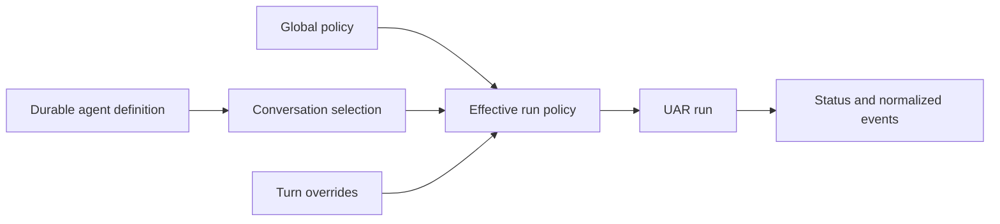

# Create and run agents

## Boundary statement

**An agent definition is durable configuration; a run is a resolved execution.**
Creating or selecting an agent does not prove that its provider, model, skills,
tools, knowledge, or memory were used. Inspect the effective configuration and
the resulting runtime state for the specific conversation.

## Diagram in words

The stored agent definition supplies a prompt and default provider, model,
skill, tool, knowledge, and memory choices. Selecting that agent writes a
conversation policy. UAR combines global, agent, conversation, and turn inputs
into the effective run policy. The run then emits status and normalized events;
those observations, not the editor state alone, identify what executed.

## What an agent configures

An agent artifact has identity and display metadata, a system prompt and
instructions, a default provider/model with optional fallbacks, tool allow/deny
rules, preferred skills, conversation-memory and knowledge-base choices, and UI
capabilities. The packaged editor exposes the supported subset of those fields.

The effective model may still come from the system default when the agent has no
explicit provider/model. A selector label such as **Using default model** names
that dependency; it is not a fixed route.

## Packaged UI workflow

1. Configure a working provider and model.
2. Open **Admin → Agents** at `/admin/agents` and choose **New agent**.
3. Create the identity and configure the prompt, provider/model, skills,
   knowledge bases, tools, and memory settings needed by the agent. Save and
   confirm the definition appears in the list.
4. Open Chat, start a fresh conversation, and select the agent from the agent
   selector. The selector projects its model, skills, tools, and knowledge-base
   choices into that conversation.
5. Send a fresh message to run the agent.
6. Inspect the effective run policy and transcript/runtime events. Confirm the
   `agent_id`, `provider_id`, and `model_id`, plus any skill activation,
   retrieval citation, memory recall, or tool lifecycle required by the claim.

Switching agents affects subsequent requests. It does not rewrite an already
running turn.

## API workflow

| Stage | Request | Observable result |
|---|---|---|
| List | `GET /api/agents` | Persisted runtime agents plus the protected built-in agents. |
| Create | `POST /api/agents` | `201 Created` and the stored agent; UAR assigns an ID when omitted. |
| Configure | `PUT /api/agents/{id}` or `PATCH /api/agents/{id}` | Full replacement or merge-patched durable definition. |
| Select | `POST /api/uar/sessions/{conversation_id}/agent-config` | Durable conversation policy containing the agent and optional model/resource selections. |
| Inspect | `GET /api/uar/sessions/{conversation_id}/effective-config` | Requested policy, resolved agent, and effective policy used for the next run. |
| Run by chat | `POST /v1/chat/completions` | A completion through the selected conversation when its session identifier is supplied. |
| Run directly | `POST /api/uar/runs` | A run ID and stream URL for the supplied artifact and input. |
| Observe | `GET /api/uar/runs/{run_id}/stream` | Replayed then live normalized events for the authorized run. |

Deleting `default-agent` or `orchestrator-agent` is refused. An unknown selected
agent can fall back to the default agent in the run-resolution path, so inspect
effective state instead of treating an attempted ID as proof.

## Embedded host workflow

An embedded host builds `EmbeddedRuntime` with a local inference driver,
matching provider/model metadata, and a persistence implementation. It manages
agent definitions through the shared transport-free agent store over that
persistence, resolves conversation configuration through the runtime manager,
and starts and observes runs in process. There is no HTTP route or packaged
React UI in this profile.

The host owns presentation and lifecycle integration. UAR still owns agent
definition semantics, policy resolution, run lifecycle, skills, tools, and
normalized events. The host must retain the run/event evidence needed for its
claim.

## Realtime state and reload authority

Agent CRUD writes durable persistence. A conversation selection is stored as
conversation policy and affects the next resolved run. Global, agent,
conversation, and turn inputs are resolved when a run starts; a change does not
retroactively mutate a binding already in flight.

Agent list and editor state are control-plane projections. Run status, effective
configuration, and normalized events are the runtime-state views. Reload the UI
to reconcile stale projections; do not infer that a displayed edit altered an
already executing run.

## Observed boundary

The retained 2026-08-22 `server-full` record, source SHA
`d41bf7c3a447869896664d44ac0563e1b4a1d9f3`, observed one API-created agent
complete a genuine OpenAI-proxy request and one UI-created agent whose effective
policy named `openai/gpt-5.4-mini` complete a fresh response. It also observed a
UI-created Kimi agent whose effective policy named `kimi-for-coding/k3` complete
one request. These are bounded observations of those agents and paths, not a
general agent or model readiness claim.

## Profile limits

- `server-full` includes the packaged Agents and Chat UI plus the HTTP run and
  configuration surfaces described here.
- `minimal` contains the server paths but not the admin UI as a profile claim.
- `embedded-mobile` uses the transport-free host workflow and requires injected
  inference and persistence.

Evidence from one profile, agent, model, or checkout does not transfer to
another. Continue with [Manage skills](/docs/skills/overview).
