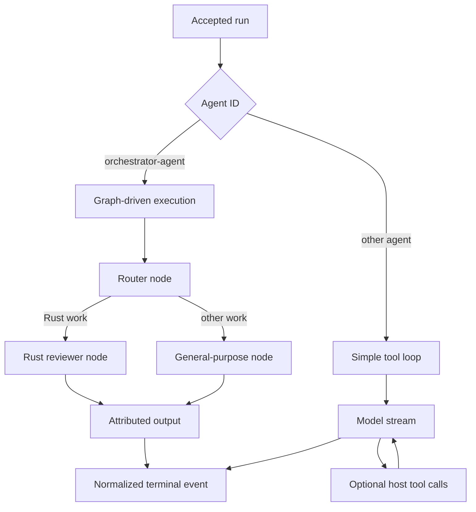

# Delegation and graph execution

## Boundary statement

**Delegation changes which runtime node performs reasoning; it does not delegate
host authority.** Every routed model call and tool request remains inside the
same run, capability boundary, event vocabulary, and configured persistence.

## Two execution paths

## Diagram in words

An accepted run checks the selected agent ID. The built-in
`orchestrator-agent` uses graph-driven execution; any other agent follows the
simple tool loop. The built-in graph starts at a router, which chooses the Rust
reviewer for Rust implementation or safety work and the general-purpose node
for other work. The selected node produces attributed output. Both graph and
loop paths end through normalized run events, and any tools still execute as
host capabilities.

## The simple tool loop

For ordinary agents, the run manager streams a model response and accumulates
tool calls. Each iteration can execute allowed tools, append their results to
the conversation, and call the model again. Runtime steps make iteration
boundaries visible. The loop ends on a final response, error, budget or policy
outcome, cancellation, or another terminal condition.

“Simple” describes the topology, not the capability set. Skills, retrieval,
memory, approvals, and native or MCP tools can still participate.

## Graph-driven execution

`AgentGraph` owns named nodes, directed or conditional edges, and an entry node.
`GraphState` carries messages, a JSON data bag, and an iteration count. Each node
receives read-only run context containing the model driver, MCP registry,
configuration, optional persistence, and run/session identity, then returns
continue, finished, or error state.

The engine traces visited node IDs and stops when a node finishes, a node errors,
no outgoing edge exists, an unknown node is selected, or the 1,000-iteration
safety limit is exceeded. The run manager converts the trace into observable
runtime-step boundaries.

## The built-in orchestrator

The current `orchestrator-agent` graph contains one router and two specialist
nodes:

- `rust-reviewer` for Rust implementation, correctness, and safety questions;
- `general-purpose` for other requests.

The final text is attributed to the selected route. If a routed node returns no
text, the run emits an explicit `delegation_output_missing` error instead of
inventing a specialist contribution.

## What is deferred

The current graph is not a general subagent-provider architecture. It does not
claim arbitrary recursive child-agent creation, a hierarchical delegation
ledger, independent tenant budgets per child, or a second remote-agent control
plane. Those ideas remain deferred until a later specification and
implementation establish them.

Graph nodes are composable runtime code, but only graphs actually attached to a
run are delivered behavior. A future graph design cannot be inferred from the
engine's generic types.

## State and persistence

Graph state is in-process working state. A graph context can carry configured
persistence, and checkpoint nodes can use the persistence boundary, but the
engine does not make every intermediate data-bag value durable. The normalized
step trace is observable and bounded by the run event lifecycle.

See [State and events](./state-and-events) before treating a graph trace as a
durable audit log.

## Profile limits

The run manager and built-in graph are used by the server compositions and the
embedded runtime builder. The surrounding capabilities still differ:
`server-full` has the full governance and transport set, `minimal` has the
default server subset, and `embedded-mobile` depends on host-injected inference
and persistence with no server transport.

A graph result in one profile certifies neither another profile's model driver
nor its storage, policy, or transport boundary.

Return to [Runtime architecture](./intro) or continue to the product workflow
guides as they become the current authority for providers, agents, skills, and
knowledge.
