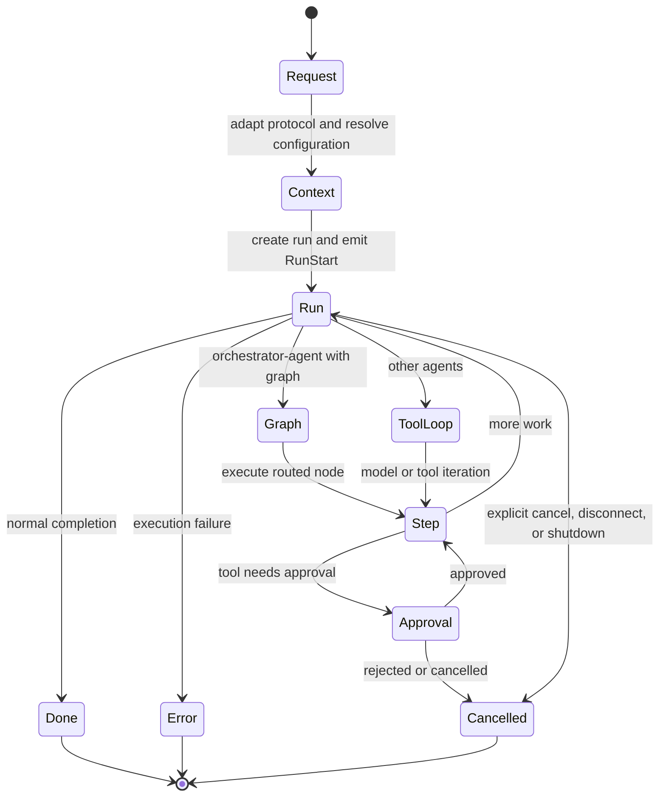

# Execution lifecycle

## Boundary statement

**A request becomes a run only after the runtime resolves its execution
context.** A turn is a caller-visible conversational interaction; current UAR
does not claim a separate typed `TurnId`. A step is observable progress inside
the run, not authority to bypass the host.

## Lifecycle map

## Diagram in words

An adapter turns an incoming request into UAR messages and configuration input.
The runtime resolves the effective agent, model route, session context, and
policy before creating a run. `RunStart` begins the observable lifecycle. The
built-in `orchestrator-agent` takes the graph branch; other agents use the
simple model-and-tool loop. Each node or loop iteration can emit step, content,
tool, memory, skill, artifact, and policy events. Approval can pause a tool call.
The run ends with normal completion, an error, or cancellation—never with an
unlabelled disappearance.

## Request and turn

Server requests arrive through HTTP adapters; embedded callers invoke runtime
services directly. Both forms provide messages and may provide session history.
In the public product vocabulary, one caller interaction is a turn. The current
wire model identifies the run and session; planned typed turn and round IDs are
not yet a delivered contract.

Before execution, UAR resolves effective configuration. Agent, conversation,
turn-level inputs, provider defaults, attached knowledge, selected skills, and
policy settings can influence the run. Later guides describe those resolution
rules in detail.

## Run startup

The run manager registers cancellation and event state, then starts asynchronous
execution. `RunStart` names the run and selected agent. State patches can expose
the run's running status, while memory-recall or skill-activation events explain
context added before or during inference.

Creating a run does not mean an external action has happened. It means UAR has
accepted execution responsibility and opened an observable lifecycle.

## Step and tool call

`RuntimeStep` carries a monotonic per-run step number with `started` or
`finished`. In graph execution, UAR derives these events from the traversed node
trace. In the simple tool loop, steps bound orchestrator iterations.

A model may stream text or produce a tool call. The host resolves the tool,
evaluates governance and risk, and then either denies, requests approval, or
executes it. A tool call has its own start, optional delta, and end events. The
tool call lifecycle sits inside the run lifecycle.

## Terminal event

UAR distinguishes three terminal classes:

- `RunDone` or `RunDoneWithUsage` means the runtime completed normally. The
  latter can carry reported token usage, model, and estimated cost.
- `Error` means execution failed. Error events do not become normal completion
  merely because a client can render their message.
- `Cancelled` means an explicit cancel, loss of the last relevant subscriber,
  graph cancellation, or server shutdown ended the run.

Clients should treat the terminal event—not the last text delta—as the lifecycle
boundary.

## Profile limits

`minimal` and `server-full` expose the server request and SSE lifecycle.
`server-full` adds the broader governance, A2A, telemetry, local-model, and admin
composition. `embedded-mobile` uses the same run manager and normalized events
in process, but it has no built-in HTTP/SSE transport; the host decides how to
present and retain them.

Lifecycle evidence remains profile-specific. An embedded run proves direct
library execution, not server streaming. A server SSE run proves the configured
server path, not a mobile host's persistence or offline behavior.

Next: [State and events](./state-and-events).
