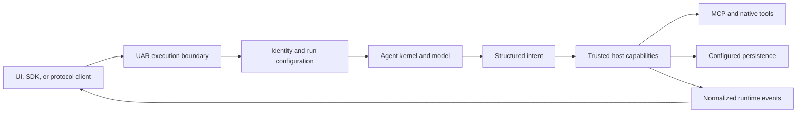

# Runtime architecture

Universal Agent Runtime (UAR) gives agent applications one inspectable execution
boundary for models, tools, skills, knowledge, memory, policy, persistence, and
streaming events. Without that boundary, each client must reconstruct provider
routing, tool safety, state, and protocol behavior—and the same request can mean
something different in every integration.

## Boundary statement

**The agent kernel reasons and proposes; the trusted host authorizes, executes,
persists, and reports effects.** This capability inversion is the organizing
idea of UAR. Model output is input to the runtime, not authority to mutate the
world.

The boundary matters because an agent can be wrong, manipulated, stale, or
underspecified. A tool name in a model response is only intent. UAR turns that
intent into a governed request, resolves the available capability, performs the
operation in trusted code, and emits the result as runtime state.

## The system map

## Diagram in words

A UI, SDK, or protocol client enters the UAR boundary. The runtime resolves the
request's identity and effective configuration before the agent kernel asks a
model to reason. Any structured intent produced by the model returns to trusted
host code. The host owns tool access and configured persistence, and it reports
progress and outcomes as normalized events back to the client. The arrows never
grant the agent kernel a direct write path to tools or storage.

## Runtime theory

UAR separates four concerns that are often collapsed into a single “agent”:

1. **Intent** — messages, instructions, model output, and selected actions.
2. **Authority** — identity, policy, approvals, and available capabilities.
3. **Execution** — model calls, tool calls, retrieval, and graph nodes performed
   by runtime-owned services.
4. **Evidence** — normalized events and configured persistence that make the
   execution inspectable.

This separation does not make a model deterministic. It makes the surrounding
system explicit: callers can see what was requested, which boundary accepted or
rejected it, what ran, and how the outcome was represented.

## One runtime, several entrances

The server profiles expose OpenAI-compatible and Anthropic-compatible HTTP,
UAR REST and SSE, MCP integrations, and feature-gated A2A surfaces. AG-UI is an
event vocabulary presented to compatible clients; A2UI carries validated
declarative UI state. An embedded host calls the same runtime services directly
and supplies its own inference and persistence implementations.

These entrances do not create independent execution engines. They adapt client
requests into the shared runtime boundary. See [Protocol boundaries](./protocols)
for the distinctions that remain after adaptation.

## Conceptual path

- [Trust boundary](./trust-boundary) follows intent across identity, policy,
  capability, execution, and event boundaries.
- [Execution lifecycle](./execution-lifecycle) maps one request through run
  startup, steps, tool calls, and a terminal outcome.
- [State and events](./state-and-events) distinguishes a live event stream from
  durable storage and agent-only context.
- [Runtime profiles](./profiles) defines which composition is actually present.
- [Protocol boundaries](./protocols) explains the typed entrances.
- [Delegation and graph execution](./delegation) documents the current
  orchestrator graph without projecting the deferred provider architecture.

## Profile limits

This page describes the shared design boundary, not identical feature sets.
`minimal` is the default server build and includes the server plus the embedded
SurrealDB backend. `server-full` adds A2A transport, Cedar governance, local
models, telemetry, the admin UI, WASM runtime, and other release capabilities.
`embedded-mobile` is transport-free: its host supplies inference and persistence
through public traits.

Evidence does not transfer between these profiles. A successful server-full
test does not certify embedded-mobile, and an embedded host integration does not
prove HTTP, A2A, Cedar, or server operations. The [profile guide](./profiles)
is the authority for those boundaries.

## What this architecture does not claim

UAR has current normalized events, a persistence abstraction, graph execution,
and profile-specific composition. Proposed typed turn identifiers, durable
session logs, spill stores, signed receipts, and a neutral component host are
not described here as delivered. Architecture proposals become product truth
only after their implementation and profile-scoped evidence exist.
