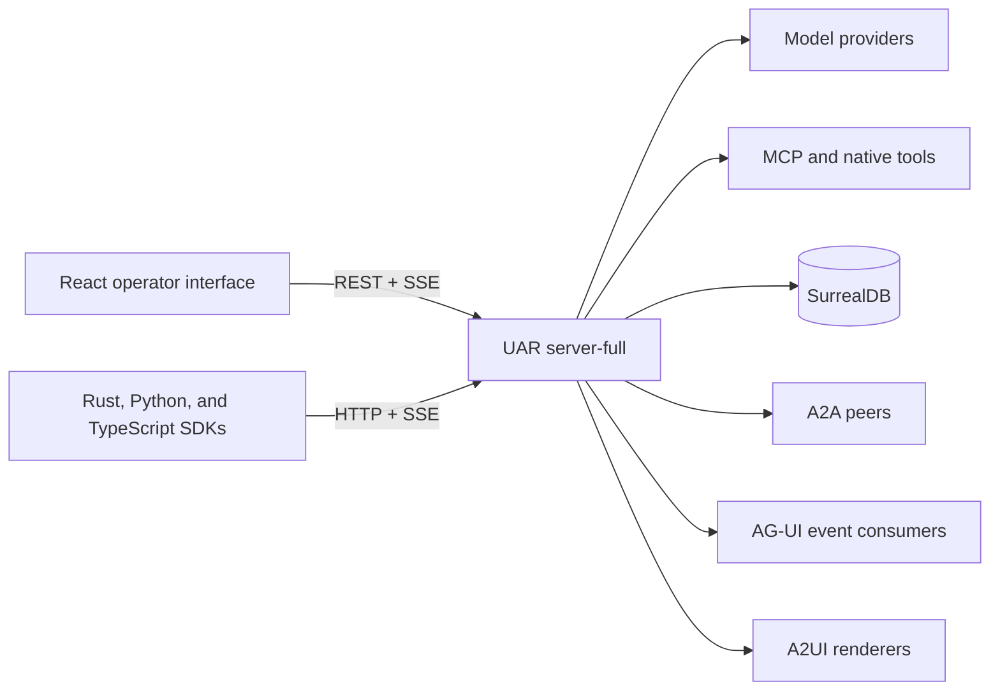
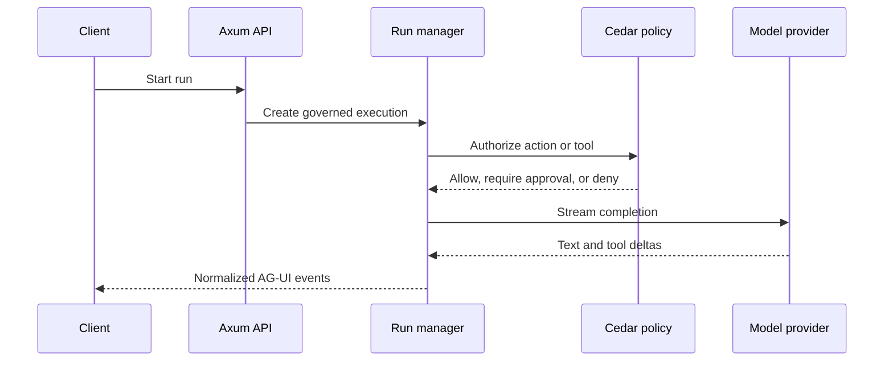
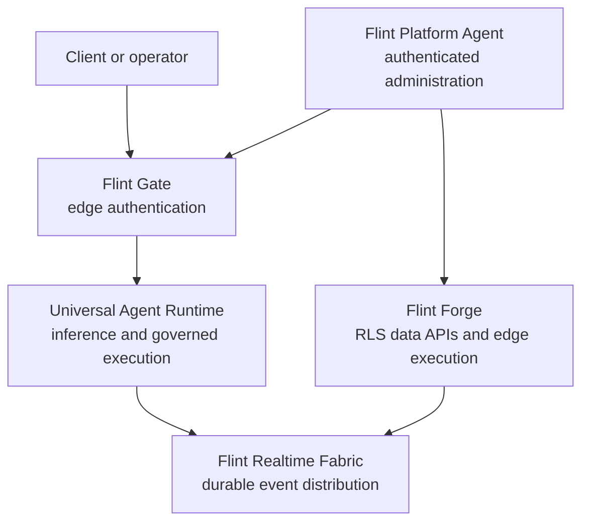

# Architecture

Universal Agent Runtime (UAR) is a Rust/Axum process that owns model routing,
agent execution, governed tool calls, retrieval, memory, and normalized runtime
events. The React 19 operator interface reaches those capabilities through typed
REST and SSE services; it never calls providers or persistence directly.

## Runtime request flow

## Prometheus platform boundary

UAR is one service in the wider Prometheus platform. It owns inference and
agent execution; the surrounding services retain their own security and data
responsibilities.

SurrealDB is the Stable server authority. PGlite is a browser or desktop cache
for local threads and messages; versioned server events reconcile the frontend
entity graph. AG-UI defines the event vocabulary. A2UI accepts validated
declarative artifacts from an approved component catalog and does not execute
model-provided HTML or JavaScript.

Read the [deployment](../deployment), [security](../security), and
[API reference](../api-reference) guides for the operational boundaries.
