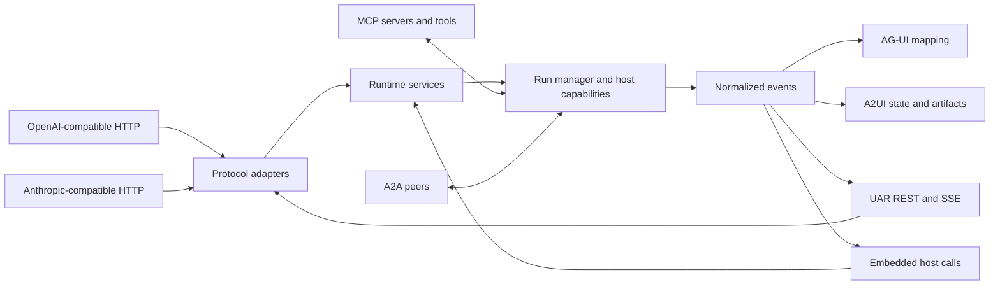

# Protocol boundaries

## Boundary statement

**A protocol adapts a request or event; it does not create a second authority
model.** Identity, effective configuration, capabilities, execution, and
runtime-owned outcomes remain inside UAR regardless of the entrance.

## Entrances and outputs

## Diagram in words

OpenAI-compatible, Anthropic-compatible, and UAR HTTP requests enter protocol
adapters before reaching shared runtime services. An embedded host skips the
network adapter and calls those services in process. MCP and A2A connect tools
or peers to the runtime, not directly to the model. Execution emits normalized
events. Server adapters can stream those events directly or map them to AG-UI;
A2UI operations carry validated declarative state. The embedded host receives
the same in-process events through its own integration.

## OpenAI-compatible HTTP

The server exposes `/v1/chat/completions` and the UAR chat completion path using
an OpenAI-style message and streaming shape. Compatibility describes the client
contract at the adapter. Provider selection and execution still pass through
UAR's configured model route and run manager.

An OpenAI-compatible request does not imply that OpenAI is the selected provider.
Provider and model setup belongs to the provider workflow guide.

## Anthropic-compatible HTTP

`/v1/messages` accepts an Anthropic-compatible message and tool shape and maps
the request into UAR execution. The adapter maps resulting content, tool, usage,
and error events back to the Anthropic stream vocabulary.

Compatibility is bounded to the implemented adapter. It is not a claim that
every upstream extension, beta header, or provider-specific behavior is present.

## UAR REST and SSE

The UAR API owns agents, providers, skills, knowledge, settings, credentials,
runs, approvals, A2UI interaction, health, and related product resources. SSE
surfaces run and entity changes to the operator interface and SDK clients.

REST resources and event streams are complementary. A live event can explain a
change, while the resource API or configured persistence remains the authority
for reloadable state.

## MCP

Model Context Protocol connects UAR to registered tool and context servers. The
runtime presents available MCP tools to the model and executes selected calls
through the host-owned registry. MCP does not hand the agent kernel a raw socket
or bypass tool lifecycle events.

The concrete server catalog, authentication, health, and reconnect behavior are
configuration and operations concerns documented separately.

## A2A

Agent-to-Agent transport connects UAR with compatible peers in the
`server-full` composition. Peer messages still enter identity and tenant-aware
runtime handling. A2A is not part of `minimal` or `embedded-mobile` by default.

## AG-UI

AG-UI is a client-facing event vocabulary. UAR maps normalized runtime events to
the supported AG-UI forms for clients that request that mode. The mapping can
preserve UAR-specific distinctions where the standard has no exact event; the
API reference owns the concrete wire catalog.

## A2UI

A2UI carries declarative surfaces and state patches. UAR validates operations
against its A2UI registry and event backbone. It does not make arbitrary
model-provided HTML or JavaScript a trusted capability.

## Profile limits

`minimal` and `server-full` contain the HTTP/SSE server surface.
`server-full` additionally contains A2A transport and the broader release
composition. `embedded-mobile` is transport-free: it does not expose these
server routes, and its host calls UAR services and consumes events directly.

Protocol evidence is not interchangeable. A successful OpenAI-compatible
server request says nothing about A2A, an AG-UI stream does not certify every
A2UI operation, and an embedded call does not certify an HTTP adapter.

Next: [Delegation and graph execution](./delegation).
