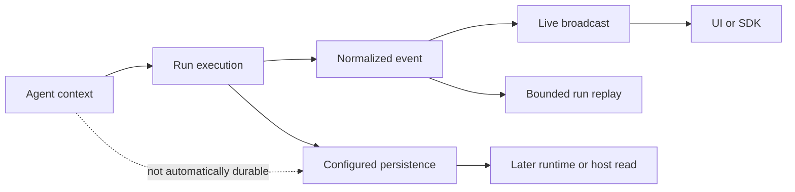

# State and events

## Boundary statement

**A normalized event is an observation, not automatically a durable record.**
Configured persistence is the authority for data it stores. Agent-only memory,
model context, and process-local replay buffers are not durable business state.

## State flow

## Diagram in words

Run execution emits a normalized event. UAR sends that event to live subscribers
and retains a bounded, process-local per-run history for reconnection. Separately,
runtime services call the configured persistence interface for sessions, agents,
skills, knowledge, settings, checkpoints, and other supported records. A later
runtime or host can reload only what the persistence implementation stored.
Conversation context influences execution but does not flow into durable storage
unless a runtime service performs an explicit persistence operation.

## The normalized event vocabulary

`NormalizedEvent` is UAR's internal tagged event vocabulary. It includes run
start and terminal outcomes, streamed text and reasoning, citations, memory
recall and mutation, skill activation, tool lifecycle, approvals and denials,
artifacts, state patches, runtime steps, budget alerts, guardrails, and errors.

Adapters can map this vocabulary to SSE or AG-UI-compatible events. Mapping does
not erase the distinction between event families: a text delta is not a tool
completion, an approval request is not a denial, and `Cancelled` is not
`RunDone`.

## Live broadcast and bounded replay

The run manager assigns a monotonically increasing event ID within each active
run. It broadcasts events to subscribers and keeps the most recent 512 events in
an in-memory deque. A subscriber can request history after a known event ID.

That buffer supports live reconnection; it is not a durable session log. Process
restart, run cleanup, or events older than the buffer limit can remove replay
history. Durable inbox/outbox semantics and a permanent boundary-event session
log are not current claims.

## Configured persistence

`PersistenceLayer` is the runtime-owned storage boundary. Its operations cover
sessions and policies, agents, skills, knowledge bases and chunks, documents,
memory, settings, attachments, graph checkpoints, and cost history. Concrete
providers decide how those records are stored.

The interface is not a promise that every event is persisted. A tool delta, text
delta, or runtime step remains live evidence unless another component records it.
Likewise, a persisted agent or knowledge document is durable state even when no
client is subscribed to its live changes.

## Agent context and memory

Messages, retrieved chunks, recalled memories, activated skills, and graph state
can enter a model's context. That context is working input. It can be truncated,
summarized, or lost after a run. It becomes durable only through an explicit
runtime-owned store operation.

This is why agent-only memory cannot own product state. Business state must live
in an inspectable host system, while the model receives a selected view for the
current execution.

## Profile limits

`minimal` uses the server composition with the embedded SurrealDB backend and a
process-local live event history. `server-full` adds telemetry, the admin UI,
Cedar governance, A2A, and other release capabilities; it still does not turn
the bounded run replay deque into a durable event log.

`embedded-mobile` requires the host to provide a `PersistenceLayer`. It creates
an in-process event backbone and can optionally receive a separate memory
service. The host owns storage paths, lifecycle, backup, encryption, and how
events reach its UI. Server persistence and SSE evidence do not certify those
host decisions.

Next: [Runtime profiles](./profiles).
