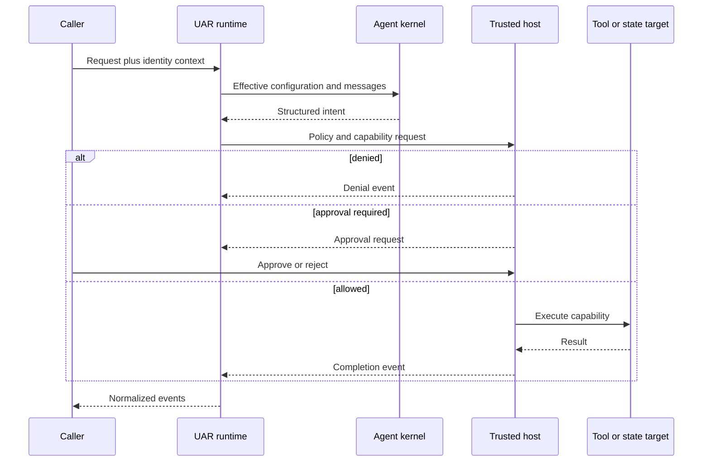

# Trust boundary

## Boundary statement

**Intent is not an effect.** An agent kernel can produce text, structured tool
intent, routing choices, or declarative UI artifacts. Only the trusted host can
turn an accepted request into a side effect and represent that effect as
completed.

This is capability inversion: the less-trusted reasoning component depends on
capabilities supplied by the host. It does not receive a second, hidden path to
the file system, network, credentials, or persistence.

## Crossing the boundary

## Diagram in words

The caller enters with request and identity context. UAR resolves effective run
configuration and gives the agent kernel only the context needed to reason. The
kernel returns structured intent to the runtime. Trusted host code evaluates
policy and capability availability. A denial becomes a denial event, an
approval-required decision pauses for an explicit response, and an allowed
operation reaches the tool or state target. Only the host's result can become a
completion event returned to the caller.

## Five boundaries, one decision path

### Identity

Identity determines which owner, tenant, session, agent, and credential context
applies. A string in model output is not an authenticated identity. Server
middleware and embedded host integration establish identity outside the agent
kernel.

### Policy

Policy answers whether the identified principal can request an action against a
resource. A policy result can allow, require approval, or deny where that policy
surface is configured. A denial is not upgraded into an approval request.

### Capability

The host resolves the named action to a registered native tool, MCP tool, skill,
retrieval service, graph node, or persistence operation. If no capability is
available, no amount of persuasive model output creates one.

### Execution

Trusted code performs the call with host-owned configuration and credentials.
Tool input and output can appear in runtime events, but the agent kernel does not
gain possession of the credential store or persistence implementation.

### Evidence

Normalized events state what the runtime observed: a tool started, required
approval, was denied, completed, or failed. Configured persistence records the
durable data its interface owns. Neither a model's claim that work succeeded nor
an unpersisted conversation is equivalent to host evidence.

## Failure semantics

- A rejected policy decision produces a denial outcome for the call; it is not a
  successful effect.
- An approval-required call is incomplete until the host receives a decision.
- A missing capability or execution error produces an error path, not invented
  output.
- Cancellation is terminal and distinct from normal completion.
- A normalized completion event reports the runtime's outcome; whether an
  external system later changes remains that system's responsibility.

## Profile limits

The authority model applies to all three profiles, but the enforcement surfaces
differ. `server-full` includes Cedar governance and the full server composition.
`minimal` includes HTTP/SSE and SurrealDB but does not inherit the server-full
Cedar governance claim. `embedded-mobile` binds no server transport; its host
supplies inference, persistence, identity context, and any platform capability.

Therefore “the host owns effects” is portable, while a specific middleware,
Cedar policy, approval endpoint, or credential store is profile-specific. Read
[Runtime profiles](./profiles) before transferring an operational claim.

Next: [Execution lifecycle](./execution-lifecycle).
