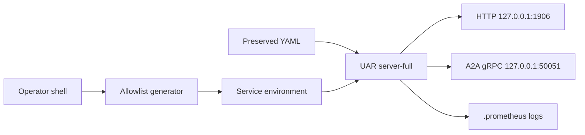

# Native services

The native package installs the `server-full` release and React application as
one supervised process. HTTP `1906` and A2A gRPC `50051` are loopback-only by
default. Provider credentials are copied once from an operator shell into a
least-privilege service environment; the supervisor never sources a full login
profile.

Choose [macOS](./macos.md), [Linux](./linux.md), or [Windows](./windows.md).
Every installer preserves existing configuration and mutable state, backs up
configuration before an additive merge, and keeps operator logs under the
platform `.prometheus` path.

A health probe proves process health, not inference. A provider is operational
only after a genuine request crosses the installed UAR boundary and returns a
model-produced response.
