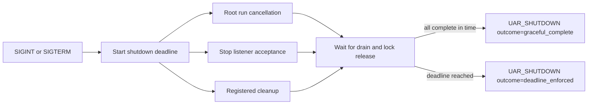

# Recover and Shut Down

Safe process termination and state recovery are related but separate procedures. A clean shutdown releases owned resources; a usable backup is proven only by restoring it and performing a functional read-back.

:::danger Boundary statement
An HTTP cancellation token stops listener acceptance in an embedding path, but it does not perform the full signal-driven process shutdown sequence. An archive that can be listed is not proof that UAR can read the restored state.
:::

## Signal-driven shutdown

The packaged process listens for SIGINT and SIGTERM through its cross-platform signal helper. On the first signal it starts a single shutdown coordinator and configured deadline, then:

1. triggers root run cancellation so in-flight runs stop model and tool work and can emit a cancelled terminal event;
2. cancels primary and companion HTTP listener acceptance immediately;
3. runs blocking ingestion cleanup and registered async cleanup concurrently;
4. waits for listeners, registered cleanup, and the embedded SurrealKV lock release;
5. emits the final outcome marker.

`server.shutdown_timeout_secs`, configured by `UAR_SERVER__SHUTDOWN_TIMEOUT_SECS`, defaults to 30 seconds. This shutdown deadline begins when the signal is received; it is not an extra delay before draining.

## Diagram in words

One process signal starts the deadline, run cancellation, listener drain, and registered cleanup. Completion before the deadline produces the graceful-complete outcome; held requests or cleanup that exceed it produce the deadline-enforced outcome and the process exits.

## Interpret the outcome

`UAR_SHUTDOWN outcome=graceful_complete` means the registered process shutdown work completed within the configured deadline. `UAR_SHUTDOWN outcome=deadline_enforced` means the watchdog ended the process; the graceful marker is intentionally absent. A process exit without either expected marker is not evidence of the documented shutdown path.

The HTTP cancellation token supplied to `start_server_sidecar` can stop its listeners and is useful to an embedding host. The host must still coordinate run cancellation, cleanup, telemetry flush, persistence close, and its own process lifecycle.

## Persistence ownership

| Configuration | State owner | Recovery method |
|---|---|---|
| Embedded `surrealkv://` or normalized `rocksdb://` | Local UAR datastore directory | Stop UAR, copy the complete directory, restore into a separate compatible environment |
| `memory` or `mem` | Current process | No persistent backup exists |
| Remote Surreal HTTP/WebSocket | Remote Surreal deployment | Use that deployment's supported export, backup, and restore procedures |
| PostgreSQL with the compiled backend | PostgreSQL deployment | Use PostgreSQL backup and restore procedures, preserving required extensions and schema compatibility |

Uploaded files and an independently configured memory database are companion state. Inventory and recover them with the primary records they reference.

## Cold backup and restore

For embedded SurrealKV, use a cold backup:

1. Send the process its normal termination signal.
2. Wait for the graceful marker and verify the datastore lock is released.
3. Copy the entire configured datastore directory to versioned, off-host storage.
4. Preserve the source UAR revision, configuration, encryption-key requirements, and companion file inventory with the backup.
5. Restore into an isolated location using a compatible UAR build. Never overwrite the only existing copy as the first restore step.

Directory listing, archive size, and checksum prove transport integrity, not application recovery.

## Functional read-back

A restore is proven only when the isolated process opens the restored store and reads a known record through the supported UAR boundary. Select a non-secret fixture before backup—such as a named agent, skill setting, or knowledge record—then verify its expected identity and content after restore. Also exercise one relationship or query that depends on the restored index. Record the command, source revision, profile, and observed response.

If credentials are part of the restored database, recover the matching encryption key through the operator's secret system. Do not print the credential while proving read-back.

## Embedded host responsibility

`embedded-mobile` gives the host responsibility for application suspension, offline state, persistence close, background task cancellation, and upgrade compatibility. The server's SIGINT/SIGTERM and listener semantics do not transfer automatically to iOS or Android lifecycle events.

## Profile limits

The full signal and dual-listener contract describes packaged `server-full` and `minimal` processes. Cleanup resources vary by compiled features. `embedded-mobile` is host-owned. A graceful shutdown does not certify backup completeness, and a successful restore of one profile does not certify another.

See [Observability](/docs/operations/observability) for markers and [Realtime State](/docs/operations/realtime) for connection recovery limits.
