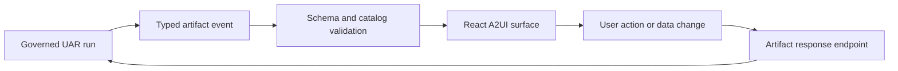

# A2UI artifacts

## Boundary statement

**A2UI renders a validated component model; it does not execute model-authored
HTML or JavaScript.** Unknown component types and unsupported artifact shapes
fail closed.

Chat can display declarative output and collect structured user input inside the
conversation. The current artifact bridge supports confirmation, single-choice,
text input, and JSON-form responses, plus display artifacts rendered through the
shared React surface renderer.

## Interaction lifecycle

1. A run emits an artifact with an ID, type, title, content, metadata, and
   status.
2. The client parses an object-shaped payload and maps supported legacy input
   types into the approved component catalog.
3. The renderer owns local form state and disables action submission while a
   response is pending or resolved.
4. A valid action posts a structured response to
   `/api/uar/runs/{run_id}/artifact-response`.
5. The block displays captured, pending, invalid, or failed state. A malformed
   JSON form remains local and is not submitted.

The protocol catalog and UAR entity-extension catalog are described in
[Events, AG-UI, and A2UI](/docs/protocols/events-and-ui). The package-level
React, Lit, and Svelte renderers have different ownership roles; only
`@prometheus-ags/a2ui-uar` is the first-party React product renderer.

## Profile limits

- `server-full` packages the React artifact block and HTTP response path.
- `embedded-mobile` may render the same declarative semantics through a
  host-owned surface, but it does not inherit the browser component or transport
  evidence.
- `minimal` can expose protocol/runtime paths but carries no packaged renderer
  claim.

See [A2UI testing](/docs/product/a2ui-testing) for the development-only trigger
surface and [Chat](/docs/product/chat) for the customer workflow.

