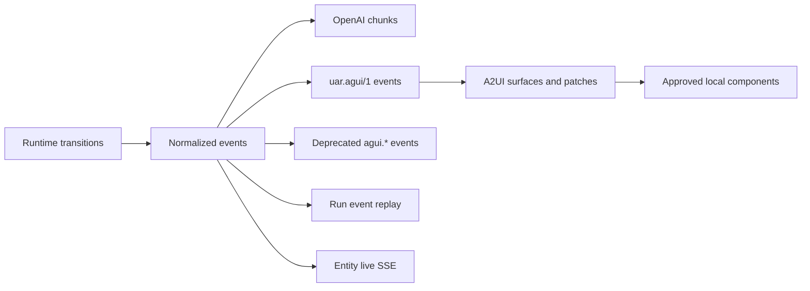

# Events, AG-UI, and A2UI

## Boundary statement

**An event describes a runtime transition; its wire vocabulary does not decide
whether the underlying state is durable.** UAR emits normalized events, maps
them to requested client forms, and retains only the replay state owned by that
specific run or A2UI backbone.

## Diagram in words

One runtime transition enters the normalized event model. A chat stream can map
it to OpenAI chunks, the `uar.agui/1` profile, or the deprecated legacy event
shape. The governed run stream records an ordered run history and follows it
with live events. Entity-live SSE is a separate update channel. A2UI consumes
validated declarative surface messages and renders only catalog-approved local
components.

## Streaming modes

| `stream_mode` | Wire behavior | Status |
|---|---|---|
| `openai` | OpenAI chunks plus documented UAR delta extensions | default |
| `agui_spec` | `uar.agui/1` with official uppercase AG-UI event vocabulary | current AG-UI profile |
| `agui` | lower-case `agui.*` events | deprecated legacy mode |
| `dual` | OpenAI chunks plus the current dual/legacy mapping | migration aid, not the AG-UI profile |

`uar.agui/1` includes run, step, text, reasoning, tool, state, raw, and custom
event families enumerated by its versioned profile. Unknown UAR custom events
must be retained for inspection or ignored safely, not interpreted as arbitrary
code.

## Replay boundary

The governed run stream accepts a replay cursor and emits events after that
cursor. In `agui_spec` mode it can also project a state snapshot consistent with
the selected history. Replay is bounded to the run history retained by the
current manager and its configured implementation; a cursor is not a promise of
an immutable cross-process ledger.

A2UI keeps ordered state patches per run through its shared realtime backbone.
The current in-process implementation lets late readers of that backbone replay
the retained patches. Process restart durability is not implied.

The `/api/live` channel carries entity mutations for the admin UI and SDK
consumers. Its reconnect behavior restores transport and current projections;
it does not make every prior entity event durable.

## A2UI trust boundary

The stable UAR profile accepts the approved A2UI message and component catalog
documented in `docs/protocols/a2ui-profile.md`. It rejects unknown components,
properties, bindings, references, and actions. Agent output cannot supply
trusted React modules, HTML, JavaScript, CSS, or remote component URLs.

Surface responses and actions return typed data through the normal store and
service boundary. Server ownership, run authorization, and validation still
apply after a widget interaction.

## State ownership

| Surface | Owner | Retention limit |
|---|---|---|
| chat SSE | active HTTP stream and session | client reconnect alone does not reconstruct every prior chunk |
| governed run SSE | run manager history plus live broadcast | bounded to retained run state and process/persistence implementation |
| `uar.agui/1` snapshot | projection of selected run history | only as complete as valid retained events |
| A2UI patches | per-run realtime backbone | ordered replay in the current backbone, not universal process durability |
| entity-live SSE | server live-query/multiplexer and browser projection | reload resource authority after disconnect or restart |

## Profile limits

`minimal` and `server-full` expose chat and run SSE. `server-full` carries the
broader admin and release composition. `embedded-mobile` receives in-process
runtime events through its host and does not inherit HTTP reconnect evidence.
A2UI profile support and AG-UI profile support are separate claims.

Next: [Model Context Protocol](./mcp.md).
