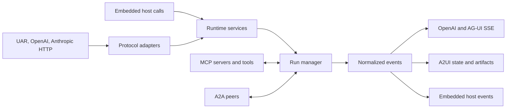

# Protocol overview

## Boundary statement

**A protocol adapter changes a wire shape; it does not create a second runtime
authority.** Identity, effective configuration, provider/model routing, tool
governance, execution, and runtime-owned outcomes remain inside UAR.

## Diagram in words

UAR, OpenAI-compatible, and Anthropic-compatible HTTP requests enter adapters
before calling shared runtime services. A transport-free embedded host calls
those services directly. MCP connects external tools and context; A2A connects
peer agents. Both still pass through host-owned identity and execution
boundaries. Runtime execution emits normalized events that server adapters map
to SSE forms, A2UI state, or an embedded host callback.

## Choose an entrance

| Need | Entrance | Output | State ownership |
|---|---|---|---|
| UAR chat | `POST /api/chat/completion` | JSON or SSE | runtime session plus caller-carried session id |
| OpenAI-shaped chat | `POST /v1/chat/completions` | OpenAI JSON/chunks and documented UAR extensions | same runtime authority as UAR chat |
| Anthropic-shaped messages | `POST /v1/messages` | Anthropic message or event vocabulary | same provider/model router and runtime |
| Governed agent lifecycle | `/api/uar/runs` | resource responses and normalized run-event SSE | run manager, replay buffer, configured persistence |
| Tool/context federation | configured MCP servers and `/mcp/uar` | MCP messages and tool results | MCP registry plus trusted host |
| Peer-agent transport | A2A routes and optional gRPC | A2A tasks, messages, and artifacts | tenant-aware A2A stores |
| Declarative UI | A2UI run routes | validated surface state and actions | A2UI registry and realtime backbone |
| Embedded application | Rust in-process API | host callbacks and return values | embedding host plus shared runtime services |

## Authority and compatibility

Compatibility applies to the implemented adapter, fields, and event forms. It
does not assert every upstream extension or transport is present. Provider
selection remains `provider/model` routing even when the client wire shape is
OpenAI- or Anthropic-compatible.

Resource APIs and live events have different authority. A database-backed
resource can be reloaded after a process restart. A live event explains a
transition but is not automatically durable history. Each protocol guide names
its replay and retention boundary.

## Profile limits

`minimal` and `server-full` contain the HTTP/SSE surface. `server-full` adds the
A2A transport and broader release feature set. `embedded-mobile` is
transport-free: the host supplies persistence and inference and consumes
in-process events. Evidence from one entrance or profile applies only to that
entrance and profile.

Next: [HTTP compatibility](./http-compatibility.md).
