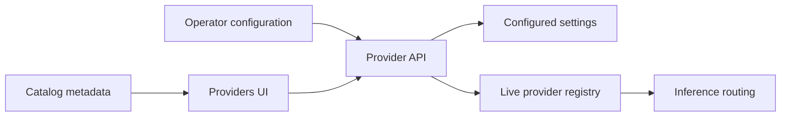

# Configure providers

## Boundary statement

**A catalog entry describes a provider; a configured provider is a live routing
candidate.** Catalog metadata can name models, capabilities, a base URL, and an
expected credential environment variable without proving that the deployment
has credentials or can complete inference.

UAR keeps those states separate. The catalog is discovery metadata. The
provider registry is the current execution authority. When durable settings are
configured, provider API writes are persisted as well as published to the live
registry.

Native packages can seed the local proxy, Kimi K3, MiniMax M3,
`alibaba/qwen3.8-max`, GLM, and
Moonshot from an allowlisted service environment. See [Native
services](/docs/native-services); bootstrap never overwrites an existing YAML
provider ID or database-backed provider/default-model choice, apart from the
documented exact migration of the obsolete native Qwen 3.7 selection and seed.

## Diagram in words

The catalog tells the UI what may be configured. An operator supplies the
deployment-specific endpoint and credential through the packaged UI or provider
API. A successful write updates the live provider registry; deployments with a
settings manager also write the durable configuration. Inference routing reads
the registry, not the catalog alone.

## Prerequisites

- Run a server profile. The packaged admin UI is part of `server-full`.
- Know the provider ID and an enabled model ID.
- Supply credentials through the deployment environment or the protected
  configuration form. Do not place secrets in source control, URLs, or logs.
- For a local or proxy provider, confirm that its base URL is reachable from the
  UAR process.

## Packaged UI workflow

1. Open **Admin → Providers** at `/admin/providers`.
2. Search or filter the catalog. A row marked **not configured** is metadata,
   not an available inference route.
3. Select a provider and choose **Configure** or **Edit Config**.
4. Enter the deployment-specific base URL and, when required, the credential.
   Leaving the credential blank during an edit preserves the existing secret.
5. Save. The provider should move to **Configured**. If it should own requests
   without an explicit provider, choose **Set as default**.
6. Inspect the provider status and the Runtime Console health view before
   treating it as operational.

A successful form close is not inference evidence. Use [Verify genuine
inference](/docs/providers/inference) after configuration.

## API workflow

The provider resource is mounted at `/api/uar/providers`:

| Action | Request | Observable result |
|---|---|---|
| Inspect catalog metadata | `GET /api/catalog` | Provider descriptions and catalog status. |
| Inspect configured state | `GET /api/uar/providers` | Registry entries plus `default_id`; secrets are represented only by `credential_configured`. |
| Create a configuration | `POST /api/uar/providers` | `201 Created` and a provider view, or `409 Conflict` when the ID already exists. |
| Replace a configuration | `PUT /api/uar/providers/{id}` | Updated provider view; an omitted credential preserves the prior secret. |
| Select the default provider | `POST /api/uar/providers/{id}/default` | `200 OK`; an unknown ID returns `404` without changing live or durable state. |
| Inspect runtime health | `GET /api/uar/providers/health` | Health, consecutive errors, and any cooldown remaining for each provider. |
| Exercise the provider | `POST /api/uar/providers/{id}/test` | A bounded real request returns provider, model, latency, and `received_text`; routing, timeout, credential, or empty-output failures remain errors. |

The test endpoint accepts an optional model ID. It never returns the stored
credential. A test success proves only that one provider/model request returned
text at that time.

## Observable failure boundaries

- An unconfigured catalog provider is unavailable for inference.
- A missing credential produces a configuration/test error rather than a
  simulated success.
- A disabled or incomplete provider/model route is rejected.
- If durable provider persistence fails, the API reports an internal error.
- Selecting an unknown default provider changes neither durable nor live state.
- Health and cooldown are observations of the current process; they are not a
  long-term availability guarantee.

## Realtime state and reload authority

Provider API mutations publish to the live registry and the UI reconciles from
the server after a successful mutation. A successful default-provider write is
made durable before live routing changes when a settings manager is present.
That selection survives reconstruction over the same persistence layer.

Environment variables and configuration files establish resolved startup
configuration. Editing those external sources does not itself mutate a running
registry: restart the process unless that deployment has explicitly verified a
supported reload boundary for the changed setting. Never infer a live change
merely because a file on disk changed.

## Profile limits

- `server-full` includes the packaged admin UI and is the profile of the retained
  provider/inference observations.
- `minimal` includes the HTTP server and provider APIs, but not the packaged
  admin UI as a profile claim. Verify the exact custom composition you ship.
- `embedded-mobile` exposes no provider HTTP or admin UI surface. Its host must
  inject the inference driver and matching provider/model metadata.

Configuration evidence does not transfer between profiles or deployments. Read
[Select models](/docs/providers/models) next.
