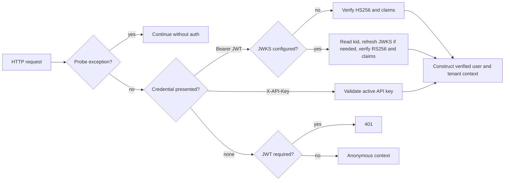

# Authenticate Requests

UAR authenticates requests before it constructs a user or tenant context. The runtime accepts a bearer JWT or an `X-API-Key`; it never treats the contents of an unverified token as identity.

:::warning Boundary statement
Authentication proves the claims accepted by this UAR process. It does not replace transport security, an internet-facing identity gateway, authorization policy, or the narrower [tenant boundary](/docs/tenancy/overview).
:::

## Choose the verification mode

JWT required mode is the default. Set `UAR_SECURITY__JWT_REQUIRED=false` only for a trusted local environment that intentionally permits anonymous requests. In required mode, startup rejects the built-in fallback JWT secret; provide a deliberate secret or a JWKS endpoint.

| Configuration | Verification path | Accepted signing algorithm |
|---|---|---|
| No `security.jwks_url` | Shared-secret verification with `security.jwt_secret` | HS256 |
| `security.jwks_url` set | Public-key lookup from the configured JWKS | RS256 |

The environment mapping uses the `UAR_` prefix and `__` between nested keys. The relevant settings are `UAR_SECURITY__JWT_SECRET`, `UAR_SECURITY__JWKS_URL`, `UAR_SECURITY__JWT_ISSUER`, `UAR_SECURITY__JWT_AUDIENCE`, and `UAR_SECURITY__JWT_VALIDATE_NBF`.

When an issuer or audience is configured, that registered claim must exist and match. Expiry validation remains active. The `nbf` claim is checked when present by default and can be controlled with `jwt_validate_nbf`.

## JWKS lookup and rotation

An RS256 token must carry a `kid`. UAR keeps a key cache per JWKS URL. A cache miss triggers a refresh; if the `kid` is still unknown, the token is rejected. An unreachable endpoint with no cached matching key also rejects the request. This supports normal key rotation without accepting a key that the configured issuer did not publish.

## Diagram in words

Health probes bypass authentication. Every other request supplies a bearer JWT or API key, or becomes anonymous only when authentication is explicitly disabled. JWT verification selects HS256 or RS256 from configuration, validates configured claims, and constructs identity only after success.

## API keys

The packaged API and `/admin/auth` UI can create, list, and revoke API keys. Creation returns the raw key once; UAR stores an Argon2 hash rather than the plaintext. The management endpoints are under `/api/uar/auth/keys` with short aliases under `/api/auth/keys`. `POST /api/uar/auth/exchange` accepts an API key and returns a short-lived HS256 bearer token. Middleware can also validate `X-API-Key` directly.

The current packaged server wires API-key records to an in-memory store. A restart therefore loses those records. Treat the UI as management of the current process, not as proof of durable key custody.

## RustCrypto provider ownership

UAR standardizes its `jsonwebtoken` operations on RustCrypto. The process-global crypto provider must be installed by UAR before encode or decode. A Provider conflict means another component initialized that global slot first; UAR returns a structured error instead of continuing with an unknown provider. Authentication middleware maps that conflict to HTTP 500, while invalid credentials map to 401 in required mode.

## Probe exceptions

`/health`, `/healthz`, `/readyz`, and `/metrics` bypass authentication so platform probes and scrapes can observe the process. They must not return private application state.

## Observable failures

- Missing, expired, malformed, wrongly signed, wrong-issuer, or wrong-audience credentials return 401 when authentication is required.
- A missing or unknown JWKS `kid`, or a failed first JWKS fetch, returns 401.
- A RustCrypto Provider conflict returns 500 and fails closed for that request.
- With JWT required disabled, missing or invalid credentials yield the anonymous context; this is a deliberate weaker mode.

## Profile limits

These behaviors describe the HTTP server in the `server-full` and `minimal` profiles. `embedded-mobile` does not own the server authentication boundary; the embedding host is responsible for its transport and caller identity. Authentication alone makes no claim about Cedar coverage, data partitioning outside A2A, or deployment-edge controls.

Next, configure [provider credentials](/docs/security/credentials) and understand the narrower [tenant boundary](/docs/tenancy/overview).
