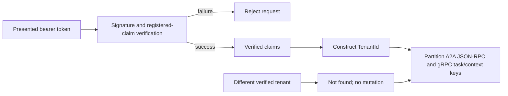

# Understand Tenant Boundaries

UAR derives its tenant identifier only from a verified credential. A token's text is never sufficient: signature and configured claim checks must succeed before `VerifiedTenantClaim` can construct a `TenantId`.

:::warning Boundary statement
Current tenant enforcement is an A2A task and context partition, not blanket isolation for every runtime subsystem. Deployment operators must evaluate each additional store, credential source, tool, provider, and transport separately.
:::

## Verified construction boundary

The bearer verifier produces a principal after HS256 or RS256/JWKS verification. If the verified claims contain `tenant_id`, the verifier wraps it as a verified claim and only then constructs the tenant identifier. A2A requests that require authentication reject missing or invalid credentials before task access.

## Diagram in words

The tenant identifier is created after credential verification. JSON-RPC and gRPC A2A handlers include it in task and context storage keys. A caller authenticated for a different tenant cannot observe, cancel, or mutate the first tenant's stored task through those handlers.

## A2A task and context partition

The current boundary covers A2A task IDs and context IDs across the JSON-RPC and gRPC transports. Reusing the same public task ID in two verified tenants produces separate stored identities. Cross-tenant denial is represented as not found rather than revealing that another tenant owns the identifier; cancellation produces no mutation in the other partition.

## Subsystem scope

UAR also uses User, Session, Agent, and Deployment scopes. Those names identify different state owners and do not automatically inherit A2A tenant enforcement. For example, provider credentials may be user-scoped, run state may be process-owned, and an embedded host may own persistence. The presence of `tenant_id` in a verified principal does not prove that every tool or external service partitions its own data.

## Operational requirements

- Require authentication on tenant-bearing A2A endpoints.
- Mint `tenant_id` only in a trusted issuer and validate issuer and audience.
- Test denial using two independently verified tenant credentials, not by changing an unverified request header.
- Audit every newly protected store and transport for explicit tenant-key propagation.

## Profile limits

This tenant claim describes the `server-full` A2A transport and task store. It does not certify `minimal`, `embedded-mobile`, arbitrary MCP servers, provider accounts, uploaded files, knowledge bases, or external databases as tenant-isolated. See [authentication](/docs/security/authentication) for credential validation and [governance](/docs/governance/overview) for policy decisions, which are separate boundaries.
