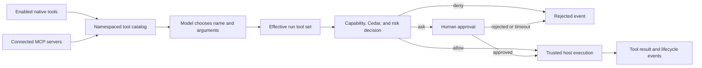

# Tools and trusted-host execution

## Boundary statement

**Tool discovery is not authorization, and an agent kernel never gains a raw
write capability.** UAR advertises a filtered schema catalog, evaluates the
effective run and policy, and lets the trusted host perform an approved call.



## Diagram in words

Enabled native tools and connected MCP servers contribute schemas to one
namespaced catalog. The model can propose a tool name and JSON arguments. UAR
checks the run's effective tool set, capability and Cedar decisions, then the
risk/approval boundary. Denial, rejection, cancellation, or approval timeout
ends without execution. Only an allowed call reaches the trusted host. Its
result returns through the runtime event lifecycle.

## Native tools

Native tools implement a host-owned name, description, JSON input schema, and
call operation. They appear under a sanitized `native__<name>` identity. The
current source contains file read/write/patch, web fetch, terminal execution,
memory, and session-search capabilities.

File, web-fetch, and terminal families are disabled by default. Enable only the
smallest family a deployment needs:

```yaml
native_tools:
  file_tools_enabled: false
  web_fetch_enabled: false
  terminal_exec_enabled: false
```

Their size, path, host, timeout, and sandbox controls are separate from model
selection. Enabling a family makes it eligible for catalog construction; it
does not guarantee that every agent or run can call it.

## MCP tools

At boot and runtime configuration changes, UAR connects configured MCP servers,
reads their tools, and creates sanitized `server__tool` names. A filtered
registry can restrict the server and tool names visible to a run. Calls have a
30-second transport timeout in the current registry. A closed transport can be
re-established for later calls, but UAR never automatically replays the failed
call because it may have completed remotely.

See [MCP](../protocols/mcp.md) for server configuration, health, and reconnect.

## Catalog, schema, and execution APIs

`GET /api/tools` exposes the current discovery catalog. The runtime also exposes
tool discovery under `/api/uar/discovery/tools`. `POST
/api/tools/{name}/execute` is a host API, not a bypass: request identity and the
mounted governance/authentication layers still apply.

Schemas constrain the shape offered to the model and the arguments accepted by
the tool implementation. Schema presence does not prove semantic safety,
availability, or permission.

## Approval and observable outcomes

Effective-run denial and Cedar denial are terminal. A risk decision can emit an
approval-required event and wait for the packaged UI or API response. Approval
cannot override a denial. Rejection, cancellation, channel closure, and the
five-minute timeout do not execute the call.

Successful and failed calls emit lifecycle events and structured telemetry.
Those signals support inspection; they are not an immutable receipt ledger.
See [Approvals](../governance/approvals.md) and [Runs](../operations/runs.md).

## Local JWT proxy

`uar-jwt-proxy` is a loopback-only development aid. It reads the local UAR JWT
configuration, mints an HS256 token, and injects it into forwarded HTTP and
WebSocket requests. Its default listener is `127.0.0.1:8088` and its default
upstream is `127.0.0.1:1906`.

Build it from the workspace:

```bash
cargo install --path tools/uar-jwt-proxy --locked
uar-jwt-proxy
```

It has no TLS termination, external identity proof, tenant onboarding, or edge
rate-limit contract and mints elevated development roles. Never expose it as a
production authentication gateway. Use a real identity-aware gateway and UAR's
JWT/JWKS verification boundary for deployed traffic.

## Profile limits

`minimal` and `server-full` can host native and MCP tools, subject to enabled
features and configuration. `server-full` includes Cedar governance; `minimal`
does not inherit that claim. `embedded-mobile` can receive an explicitly
host-supplied filtered registry, but owns no server tool routes and grants no
capability implicitly. Tool evidence applies only to the named tool, policy,
host, and profile.

Next: [SDK selection](../sdks.md).
